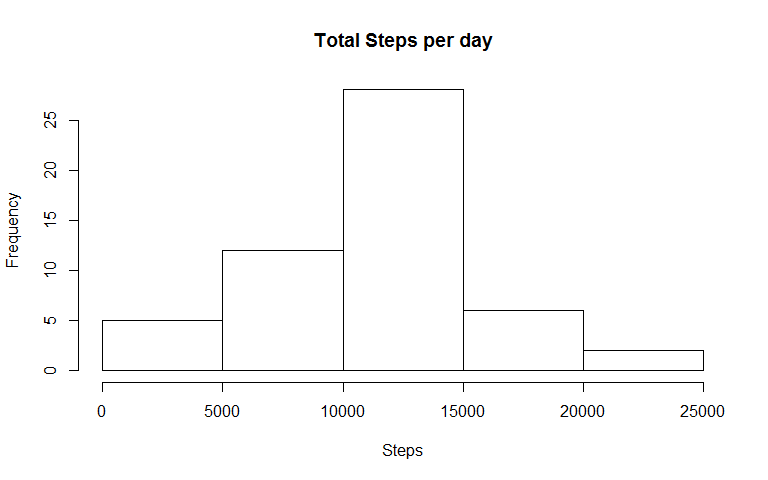
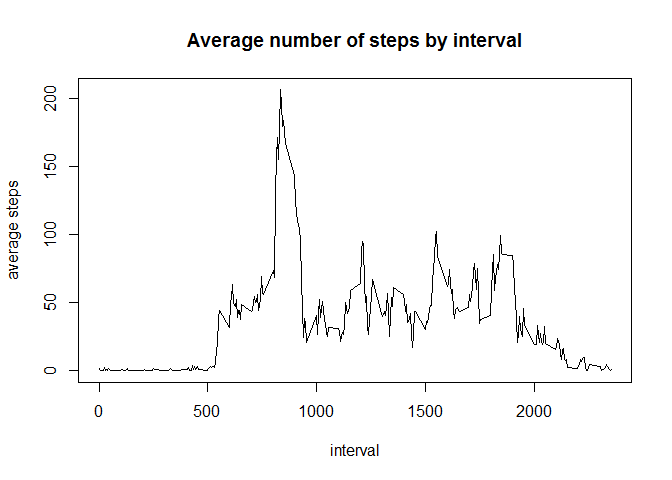
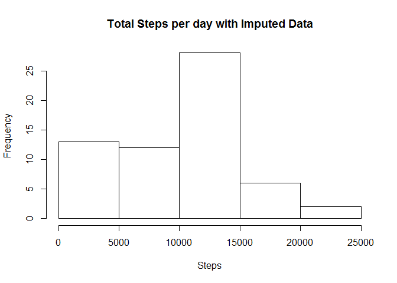
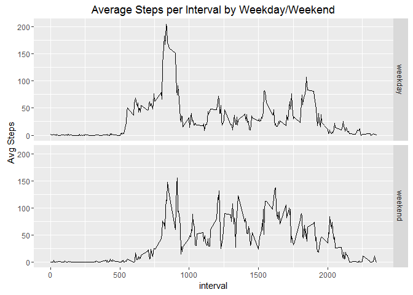

# Reproducible Research: Peer Assessment 1 by Alisha Adrian

## Introduction to Project

It is now possible to collect a large amount of data about personal movement using activity monitoring devices such as a Fitbit, Nike Fuelband, or Jawbone Up. These type of devices are part of the "quantified self" movement -- a group of enthusiasts who take measurements about themselves regularly to improve their health, to find patterns in their behavior, or because they are tech geeks. But these data remain under-utilized both because the raw data are hard to obtain and there is a lack of statistical methods and software for processing and interpreting the data.

This assignment makes use of data from a personal activity monitoring device. This device collects data at 5 minute intervals through out the day. The data consists of two months of data from an anonymous individual collected during the months of October and November, 2012 and include the number of steps taken in 5 minute intervals each day.

This data analysis will consider several questions about the individual's activity by examining the average number of steps per day, the daily activiy pattern, and weekday/weekend comparisons.


## Setting Global Options
Ensure that all code is echoed into document and all results are shown.

```r
knitr::opts_chunk$set(echo=TRUE, results="show")
```


## Loading and preprocessing the data

First, we must load the necessary R packages.

```r
library("knitr", lib.loc="~/R/win-library/3.3")
library("markdown", lib.loc="~/R/win-library/3.3")
```

```
## Warning: package 'markdown' was built under R version 3.3.2
```

```r
library("rmarkdown", lib.loc="~/R/win-library/3.3")
library("dplyr", lib.loc="~/R/win-library/3.3")
```

```
## Warning: package 'dplyr' was built under R version 3.3.2
```

```
## 
## Attaching package: 'dplyr'
```

```
## The following objects are masked from 'package:stats':
## 
##     filter, lag
```

```
## The following objects are masked from 'package:base':
## 
##     intersect, setdiff, setequal, union
```

```r
library("lubridate", lib.loc="~/R/win-library/3.3")
```

```
## Warning: package 'lubridate' was built under R version 3.3.2
```

```
## 
## Attaching package: 'lubridate'
```

```
## The following object is masked from 'package:base':
## 
##     date
```

```r
library("ggplot2", lib.loc="~/R/win-library/3.3")
```

Next, we read in the data, which is assumed to be stored in a subdirectory of the current working directory named "data". The data file is named "activity.csv"

```r
act.data <- read.csv2("data/activity.csv", sep=",")
```

Now, we do a quick summary of the data.

```r
s = summary(act.data)
s
```

```
##      steps                date          interval     
##  Min.   :  0.00   2012-10-01:  288   Min.   :   0.0  
##  1st Qu.:  0.00   2012-10-02:  288   1st Qu.: 588.8  
##  Median :  0.00   2012-10-03:  288   Median :1177.5  
##  Mean   : 37.38   2012-10-04:  288   Mean   :1177.5  
##  3rd Qu.: 12.00   2012-10-05:  288   3rd Qu.:1766.2  
##  Max.   :806.00   2012-10-06:  288   Max.   :2355.0  
##  NA's   :2304     (Other)   :15840
```
Note that there are no negative number of steps, which is good, but there are 2304 NA's. These will need to be removed when computing statistics.


## What is mean total number of steps taken per day?

To answer this question, we first must sum the number of steps across all intervals for each day. The instructions say that we can ignore the missing values for this question.


```r
# gather complete cases, group by date, then total steps across intervals   
ts = act.data[complete.cases(act.data), ] %>%
        group_by(date) %>%
        summarise(total=sum(steps)) 

# create histogram
hist(ts$total, main="Total Steps per day", xlab="Steps")
```

<!-- -->

```r
l = length(ts$date)
```


Histogram of the total steps per day (n = 53 days)


```r
orig.mean = format(round(mean(ts$total),0), scientific=FALSE)
orig.med = median(ts$total)
```

Using the original data the mean total steps per day is 10766; while the median total steps per day is 10765.


## What is the average daily activity pattern?

To investigate this question, we will construct a time-series plot of the average number of steps taken for each interval.


```r
avg_steps = act.data[complete.cases(act.data), ] %>%
        group_by(interval) %>%
        summarise(avg=mean(steps)) 

plot(avg_steps$interval, avg_steps$avg, type="l", xlab="interval",
     ylab="average steps", main="Average number of steps by interval")
```

<!-- -->

```r
max.steps = max(avg_steps$avg)
max.steps
```

```
## [1] 206.1698
```

```r
max.interval = avg_steps$interval[avg_steps$avg==max.steps]
max.interval
```

```
## [1] 835
```


The interval with the maximum average number of steps is the interval labeled 835.


## Imputing missing values

In this dataset, there are over 2300 missing values, which is over 13% of the observations. In this section, we imput the missing values by using the interval median. 


```r
# start by finding the medians
med_steps = act.data[complete.cases(act.data), ] %>%
        group_by(interval) %>%
        summarise(med=median(steps)) 

# now replace missing values
imput_steps = act.data
for (j in 1:length(imput_steps$steps))
{ if (is.na(imput_steps$steps[j]))
imput_steps$steps[j]=  med_steps$med[which(imput_steps$interval[j] == med_steps$interval)]
}

summary(med_steps)
```

```
##     interval           med        
##  Min.   :   0.0   Min.   : 0.000  
##  1st Qu.: 588.8   1st Qu.: 0.000  
##  Median :1177.5   Median : 0.000  
##  Mean   :1177.5   Mean   : 3.962  
##  3rd Qu.:1766.2   3rd Qu.: 0.000  
##  Max.   :2355.0   Max.   :60.000
```

```r
sum.orig = summary(act.data)
sum.imput = summary(imput_steps)

# histogram of total number of steps taken each day on imputed data.

# gather cases, group by date, then total steps across intervals   
ts.imput = imput_steps %>%
        group_by(date) %>%
        summarise(total=sum(steps)) 

# create histogram
hist(ts.imput$total, main="Total Steps per day with Imputed Data", xlab="Steps")
```

<!-- -->

```r
imput.mean = format(round(mean(ts.imput$total),0),scientific = FALSE)
imput.med = median(ts.imput$total)
```


Using the imputed data the mean total steps per day is 9504; while the median total steps per day is 10395.

Remember that, using the original data the mean total steps per day is 10766; while the median total steps per day is 10765.

This change in summary statistics is not surprising because in many intervals, the median value was zero. Therefore, by replacing the missing values with zero, we increased the count of observations, but did not increase the total value of the observations. The mean equals the total divided by the count, so it is highly influenced by appending more zeros to the data set. On the other hand, the median is not influenced as strongly by the imputation because it causes the index of the median value to shift, but the values being zero have no direct effect other than determining the direction of the shift. 


## Are there differences in activity patterns between weekdays and weekends?


```r
# add day of week to imputed data frame
day = weekdays.Date(as.Date(imput_steps$date))
imput_steps = cbind(imput_steps,day)
weekend = imput_steps$day == "Sunday" | imput_steps$day == "Saturday"
part = rep("none",length(weekend))
part = ifelse(imput_steps$day == "Sunday" | imput_steps$day == "Saturday","weekend","weekday")
imput_steps = cbind(imput_steps,part)

## separate by weekend and weekday then compute avg steps by interval

wkend = imput_steps[part=="weekend",]
wkday = imput_steps[part=="weekday",]

wkend_avg_steps = wkend %>%
        group_by(interval) %>%
        summarise(avg=mean(steps)) 

wkday_avg_steps = wkday %>%
        group_by(interval) %>%
        summarise(avg=mean(steps)) 

# add type of day variable
wkend_avg_steps = cbind(wkend_avg_steps,type=rep("weekend",length(wkend_avg_steps$interval)))

wkday_avg_steps = cbind(wkday_avg_steps,type=rep("weekday",length(wkday_avg_steps$interval)))

day_avg_steps = rbind(wkday_avg_steps,wkend_avg_steps)


## build an informative plot
# create initial construct
g = ggplot(day_avg_steps,aes(x=interval, y=avg))

# add features
g + geom_line() +              # points
  facet_grid(type~.) +          # separate by type
  labs(y="Avg Steps") +  # y label
  labs(title="Average Steps per Interval by Weekday/Weekend")   # top title
```

<!-- -->

This plot reveals that the person generally slept later and then was more active during the weekend days. For example, they were less active in the early morning (5 am through 8 am [intervals 500-800]) on the weekends than on the weekdays. In addition, they were more active across the day(10 am to 5:30 pm [intervals 1000-1730]) and in the late evening (8 pm to 10 pm [intervals 2000-2200]) on the weekends.
